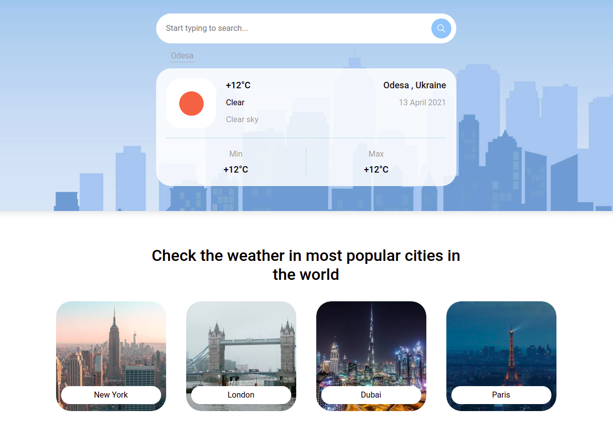

# Weather App

## Overview

The Vanilla JavaScript Weather App is the application created as a solution of Steel Kiwi frontend intern test task.

## Description

The weather app using a provided layout and Free weather API with pure vanilla Javascript, HTML and CSS/SASS. The Weather app allows user to search for the current weather for a city.

## Example

<a href="./sk-weather-example-day.png">
    
</a>

## System Requirements

- [git](https://git-scm.com/)
- [NodeJS](https://nodejs.org/)
- [npm](https://www.npmjs.com/)

All of these must be available in your `PATH`. To verify things are set up
properly, you can run this:

```shell
git --version
node --version
npm --version
```

If you have trouble with any of these, learn more about the PATH environment
variable and how to fix it.

## Setup

After you've made sure to have the correct things (and versions) installed, you
should be able to just run a few commands to get set up:

```
git clone https://github.com/xcyde/sk-frontend-intern-test-task.git
cd sk-frontend-intern-test-task
npm i
```

This may take a few minutes.

If you get any errors, please read through them and see if you can find out what the problem is.

## Running the app

To get the app up and running (and really see if it worked), run:

```shell
npm start
```

This should start up your browser.

## Requirements of test task

#### Basic

- [x] The user enters their city name in the search box at the top of the page and press Enter / Click search button
- [x] The user will see a dropdown with the list of found cities or empty state if cities were not found
- [x] When the user clicks on the found city - user must see selected city weather data in the main weather widget
- [x] When the user clicks on the card with the popular city - they must see selected city weather and scroll the window to the weather widget if needed
- [x] FAQ Dropdowns should work. (Open / close)

#### UI

- [x] The app should be responsive. You should create a totally responsive layout for all modern devices
- [x] You need to use weather icons from the [openweathermap](https://openweathermap.org/)
- [x] The Year value in the footer should be dynamic

#### Advanced

- [x] You can see two states called “day” and “night” mode in design. When a user opens the page you should detect their machine local time and use two different hero images, weather icons and some style rules that depend on user local time. If user time is between 21:00 and 06:00 - use “night” layout, in the other case (from 06:00 to 21:00) you should use “day” layout. You don’t need to observe this. Just apply the correct layout on the page refresh. Openweathermap service provides both icon packs for day time and for night time, you can read about icons [here](https://openweathermap.org)
- [x] Show 5 latest cities with success searches below the search field (even if user refreshes the page) (Example [here](https://sinoptik.ua/))
- [ ] Use some creative animations/transitions

## Key factors to the success of the test task

Below, you can find the list of key aspects for completing the test task successfully:

- Readability and good structure of code.
- Use of hints and lints to validate code.
- All necessary dependencies must be recorded in package.json.
- Capacity/efficiency of the test task (take into account the fact that the person who will be checking the test task may not have the global packages installed on your laptop).
- The result must be published on GitHub/GitLab/Bitbucket etc.
- There must be the README file with a detailed process of how to run the project.

JavaScript:

- Use one of the modern ECMA standards.
- Use OOP principles where necessary.

HTML/CSS:

- Layouts must be adapted and cross browser (latest versions: Chrome,Firefox,Safari, Edge).
- Using a CSS preprocessor will be a plus.
- Using methodology such as BEM will be a plus. (CSS/SCSS)
